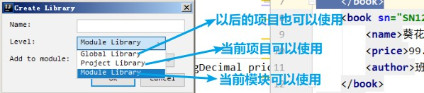

## idea下载、安装、使用文档：

[idea下载、安装、使用文档]: 尚硅谷_宋红康_IntelliJIDEA的安装、配置与使用(简化版).pdf

## 常用快捷键

### 复制移动

alt+enter  提示

ctrl+D     复制当前行到下一行

ctrl+Y     删除一行

alt+shift+上下箭头	上下移动一行或多行快捷键

ctrl + alt + <-：回到上一步 

ctrl + alt + ->：回到下一步 

### 添加注释：

ctrl+/	添加注释

ctrl+shift+/：选中多行后注释、在类或方法上添加注释

### 类、方法、变量中的快捷键：

ctrl+p：查看方法的参数

alt+7：查看类的方法

ctrl+h：查看继承结构

ctrl+alt+鼠标：查看方法的实现

shift+shift：Search Everywhere

ctrl+O     重写方法

shift+f6	批量修改变量名，该文件名

ctrl+n：搜索类

ctrl+g：跳转到文档的某一行

ctrl + shift + t : 添加相应的测试类

### 补全：

ctrl+alt+v	自动补全返回值

ctrl+shift+enter    快捷补全分号

shift+enter	跳到并新建下一行

ctrl+alt+l（L）   格式化代码

alt+insertif 按回车

ctrl+alt+t：surround with 快速的添加包含，如：try/catch

### 快速代码：

iter：遍历数组，回车
abc.for 遍历数组，回车 
.sout（=system.out.println()）：自动的输出内容
sout（=system.out.println()）
psvm（=public static void main(String[] args){}）

.var 自动补全返回变量

ctrl+f9：修改页面后，重新编译页面，不需要重启springboot

jsp(补全)：

form:get

input:test

### 导入第三方jar包

1. 在module下新建lib文件夹
2. 将jar包复制到lib下
3. 右键jar包选择"Add as Library.."即可
4. jar包类型

## IDEA 整合 Tomcat 服务器

操作的菜单如下：

File | Settings | Build, Execution, Deployment | Application Servers，配置你的 Tomcat 安装目录：

之后创建model时即可选择tomcat

## IDEA 中创建动态 web 工程

### a) IDEA 中如何创建动态 web 工程

### c) 如何给动态 web 工程添加额外 jar 包

方式一：（同上述）

方式二：

1. 可以打开项目结构菜单操作界面，添加一个自己的类库：

   

2. 添加你你类库需要的 jar 包文件。

   

3. 选择你添加的类库，给哪个模块使用：

   

   

4. 选择 Artifacts 选项，将类库，添加到打包部署中：

   

### d) 如何在 IDEA 中部署工程到 Tomcat 上运行

1. 建议修改 web 工程对应的 Tomcat 运行实例名称：

   

2. 确认你的 Tomcat 实例中有你要部署运行的 web 工程模块：

   

3. 你还可以修改你的 Tomcat 实例启动后默认的访问地址：

   

4. 在 IDEA 中如何运行，和停止 Tomcat 实例。 

   正常启动 Tomcat 实例：

   Debug 方式启动 Tomcat 运行实例：

   停止 Tomcat 运行实例：

   

   重启 Tomcat 运行实例：

   

   

### e) 修改工程访问路径

### f) 修改运行的端口号

### g) 修改运行使用的浏览器

### h) 配置资源热部署

## IDEA 中 Debug 调试的使用

Debug 调试代码，首先需要两个元素：断点 + Debug 启动服务器

1、断点，只需要在代码需要停的行的左边上单击，就可以添加和取消

2、Debug 启动 Tomcat 运行代码：

测试工具栏:

变量窗口

变量窗口：它可以查看当前方法范围内所有有效的变量。

方法调用栈窗口

1、方法调用栈可以查看当前线程有哪些方法调用信息

2、下面的调用上一行的方法

其他常用调试相关按钮：

